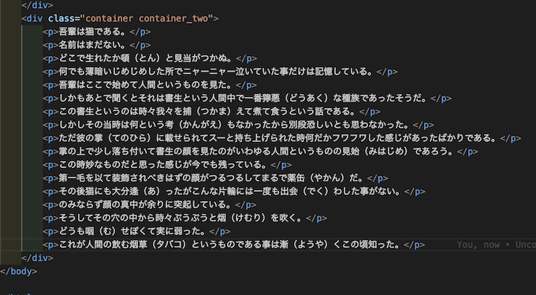
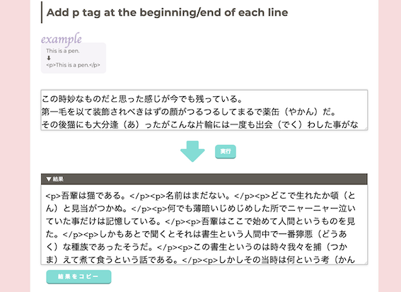

# ダミーテキストが複数ほしくなったのでpythonで作ってみます

## やりたいこと

句読点`。`ごとに改行させた文章がたくさんほしい。

## 1.まずは適当な文章を持ってくる

```py
s ="吾輩は猫である。名前はまだない。どこで生れたか頓（とん）と見当がつかぬ。何でも薄暗いじめじめした所でニャーニャー泣いていた事だけは記憶している。吾輩はここで始めて人間というものを見た。しかもあとで聞くとそれは書生という人間中で一番獰悪（どうあく）な種族であったそうだ。この書生というのは時々我々を捕（つかま）えて煮て食うという話である。しかしその当時は何という考（かんがえ）もなかったから別段恐しいとも思わなかった。ただ彼の掌（てのひら）に載せられてスーと持ち上げられた時何だかフワフワした感じがあったばかりである。掌の上で少し落ち付いて書生の顔を見たのがいわゆる人間というものの見始（みはじめ）であろう。この時妙なものだと思った感じが今でも残っている。第一毛を以て装飾されべきはずの顔がつるつるしてまるで薬缶（やかん）だ。その後猫にも大分逢（あ）ったがこんな片輪には一度も出会（でく）わした事がない。のみならず顔の真中が余りに突起している。そうしてその穴の中から時々ぷうぷうと烟（けむり）を吹く。どうも咽（む）せぽくて実に弱った。これが人間の飲む烟草（タバコ）というものである事は漸（ようや）くこの頃知った。"
```

この時、文章中の空白などが邪魔であった場合、

```py
def remove_whitespace(s):
    s = re.sub(r"\s+", "", s)
    return s
```

などで解決させる。

# 2.`。`ごとに区切ってリストに格納

下記の方法がある

## ver1

```py
found = re.findall(".*?。", s)
```

## ver2

```py
found = re.split("(?<=。)(?=.)", s)
```

# 3.リストの値を一個一個改行して取り出す

```py
print("\n".join(found))
```

# まとめるとこんな感じ

```py
import re

s ="吾輩は猫である。名前はまだない。どこで生れたか頓（とん）と見当がつかぬ。何でも薄暗いじめじめした所でニャーニャー泣いていた事だけは記憶している。吾輩はここで始めて人間というものを見た。しかもあとで聞くとそれは書生という人間中で一番獰悪（どうあく）な種族であったそうだ。この書生というのは時々我々を捕（つかま）えて煮て食うという話である。しかしその当時は何という考（かんがえ）もなかったから別段恐しいとも思わなかった。ただ彼の掌（てのひら）に載せられてスーと持ち上げられた時何だかフワフワした感じがあったばかりである。掌の上で少し落ち付いて書生の顔を見たのがいわゆる人間というものの見始（みはじめ）であろう。この時妙なものだと思った感じが今でも残っている。第一毛を以て装飾されべきはずの顔がつるつるしてまるで薬缶（やかん）だ。その後猫にも大分逢（あ）ったがこんな片輪には一度も出会（でく）わした事がない。のみならず顔の真中が余りに突起している。そうしてその穴の中から時々ぷうぷうと烟（けむり）を吹く。どうも咽（む）せぽくて実に弱った。これが人間の飲む烟草（タバコ）というものである事は漸（ようや）くこの頃知った。"

found = re.findall(".*?。", s)

print("\n".join(found))
```

▼結果

```text
吾輩は猫である。
名前はまだない。
どこで生れたか頓（とん）と見当がつかぬ。
何でも薄暗いじめじめした所でニャーニャー泣いていた事だけは記憶している。
吾輩はここで始めて人間というものを見た。
しかもあとで聞くとそれは書生という人間中で一番獰悪（どうあく）な種族であったそうだ。
この書生というのは時々我々を捕（つかま）えて煮て食うという話である。
しかしその当時は何という考（かんがえ）もなかったから別段恐しいとも思わなかった。
ただ彼の掌（てのひら）に載せられてスーと持ち上げられた時何だかフワフワした感じがあったばかりである。
掌の上で少し落ち付いて書生の顔を見たのがいわゆる人間というものの見始（みはじめ）であろう。
この時妙なものだと思った感じが今でも残っている。
第一毛を以て装飾されべきはずの顔がつるつるしてまるで薬缶（やかん）だ。
その後猫にも大分逢（あ）ったがこんな片輪には一度も出会（でく）わした事がない。
のみならず顔の真中が余りに突起している。
そうしてその穴の中から時々ぷうぷうと烟（けむり）を吹く。
どうも咽（む）せぽくて実に弱った。
これが人間の飲む烟草（タバコ）というものである事は漸（ようや）くこの頃知った。
```

# 余談

これがしたかったわけです



pタグをつけるには以前JavaScriptでタグを自動でつけてくれるツールを作ったのでそれを使いました

他に方法あると思います(しなんならpythonでそこまで処理させればいい)が、せっかく作ったので愛着です(笑)

改行はエディタの機能で整形して解決してます(なんならエディタでタグも付けてくれそう)

